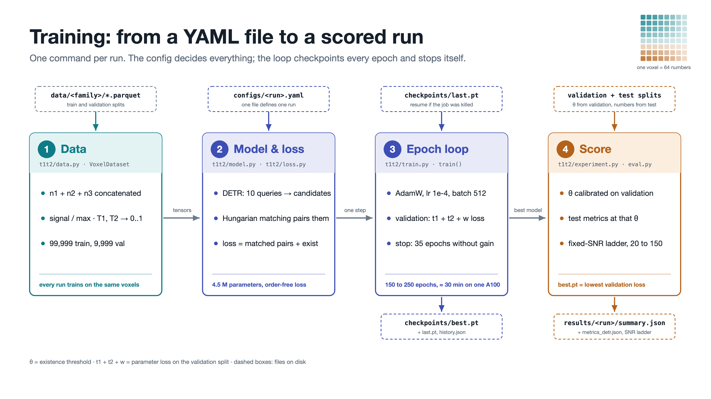
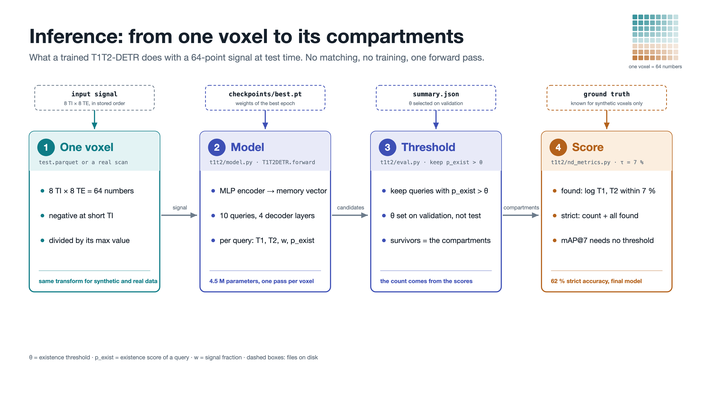

# T1T2-DETR

Code and results for the bachelor's thesis *Detection Transformer for Microstructure
Quantification from T1-T2 Correlation MRI* (Fatih Özkan, Technische Hochschule Ingolstadt,
2026, supervised by Sebastian Endt in the group of Prof. Dr. Marion Menzel).

An MRI voxel holds water in several compartments, each relaxing with its own T1 and T2. A
T1-T2 correlation scan records 64 numbers per voxel (8 inversion times x 8 echo times), and
recovering the compartments from them is ill-posed. The thesis treats it as object detection:
a Detection Transformer (DETR) reads the 64 measurements and returns a fixed set of candidate
compartments, each with T1, T2, signal fraction and an existence score, matched to the truth
with the Hungarian algorithm during training. The architecture follows DETR (Carion et al.
2020) and the diffusion-correlation DETRs of Schlund and Wirth; [CREDITS.md](CREDITS.md)
separates inherited from original work.

## Layout

```
main.py                 runs the pipeline: data, train, evaluate, aggregate, figures, notebook
datagen/                synthetic data generator: forward model, sampler, noise
t1t2/                   model, loss, training loop, scoring
evaluation/             scripts that score finished runs and compare them
evaluation/figures/     one script per thesis figure
configs/                one YAML per trained run, and the experiment matrix with its results
results/                config, training curve and metrics of every run; two checkpoints
data/                   dataset manifests (the parquet files are regenerated)
figures/                the thesis figures
notebooks/thesis.ipynb  executed walk-through: data, example voxels, every results table
```

Start with `notebooks/thesis.ipynb`; its Part 3 runs on a fresh clone. Every folder has a
short README. The experiments and their numbers are in [configs/README.md](configs/README.md),
the evaluation protocol in [evaluation/README.md](evaluation/README.md).





## Setup

```bash
pip install -r requirements.txt
pip install torch          # or the CUDA wheel from pytorch.org
```

Torch is not in `requirements.txt` so that pip cannot replace a CUDA build with a CPU one.
`numpy` is pinned because the generator's random streams depend on the version. Every
command below runs from the repository root with `PYTHONPATH=.:datagen`.

Smoke test, a few seconds of data and a quarter-size model for three epochs:

```bash
for n in 1 2 3; do
  PYTHONPATH=.:datagen python datagen/run_generator.py --n-comp $n --smoke --out-dir data/dev/n$n
done
PYTHONPATH=.:datagen python -m t1t2.experiment --config configs/smoke.yaml --no-resume
```

## Checkpoints

`results/loss_uniform/checkpoints/best.pt` (the final model) and
`results/baseline_v2_reproduction/checkpoints/best.pt` (the reference) are in the
repository. The other 24 runs are attached to the GitHub release; unpacked at the root they
land in `results/<run>/checkpoints/best.pt`, where every script looks for them:

```bash
curl -L -o checkpoints_best.zip https://github.com/fatihoezkan/t1t2-detr/releases/download/v1.1.0/checkpoints_best.zip
unzip -o checkpoints_best.zip
```

[results/README.md](results/README.md) shows how to load one.

## Reproducing

`main.py` runs the stages in order and skips every step whose outputs already exist:

```bash
python main.py                                        # all stages
python main.py evaluate figures --runs loss_uniform   # some stages, some runs
python main.py --force figures                        # redo even if the outputs exist
python main.py --dry-run                              # print the plan
```

The same stages as single commands:

```bash
# data: one file per compartment count (data/README.md has the second family)
for n in 1 2 3; do
  PYTHONPATH=.:datagen python datagen/run_generator.py --n-comp $n \
      --out-dir data/t1_3500_t2_500_100k/n$n --seed 3500500 \
      --n-train 33333 --n-val 3333 --n-test 3333 --n-per-snr 1667 \
      --t1-min 50 --t1-max 3500 --t2-min 5 --t2-max 500
done

# train: one run, about 30 min on one A100, writes results/<name>/; resumes from last.pt
PYTHONPATH=.:datagen python -m t1t2.experiment --config configs/loss_uniform.yaml

# evaluate: evaluation/README.md lists every script
PYTHONPATH=.:datagen python evaluation/run_nd_evaluation.py results/loss_uniform
PYTHONPATH=.:datagen python evaluation/calibrate_threshold.py loss_uniform
PYTHONPATH=.:datagen python evaluation/compare_experiments.py --all

# notebook
jupyter nbconvert --to notebook --execute --inplace --ExecutePreprocessor.timeout=-1 notebooks/thesis.ipynb
```

Training all 26 runs takes about a day on a GPU node; submit one config per cluster job and
run the other stages afterwards.

## The result

`baseline_v2_reproduction` is the reference and eleven arms each change exactly one thing.
Only `loss_uniform`, which removes the signal-fraction weighting from the loss, clears the
seed spread: 61.4 % strict voxel accuracy and 0.764 mAP@7 over four seeds against 57.6 % and
0.664 for the reference. It is the final model of the thesis. The loss weighting governs how
well a faint compartment is placed, not whether it is found. Tables for every arm, the
combined models and the fixed-SNR ladder are in [configs/README.md](configs/README.md).

## Limitations

The model is trained on simulated data only, with random compartments rather than tissue
prototypes, so the results do not establish in-vivo performance. The upper T2 range is
weakly constrained by the protocol's echo times, and every arm except three rests on one
training run.

## Use of AI tools

Claude Code (Anthropic) and Codex (OpenAI) were used to write and debug the code. All code
was reviewed and tested by me, every reported number was produced by running it, and no AI
tool generated or altered data or results. The thesis carries the same statement.
